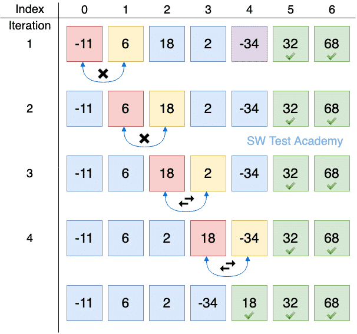
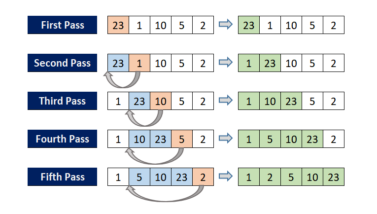
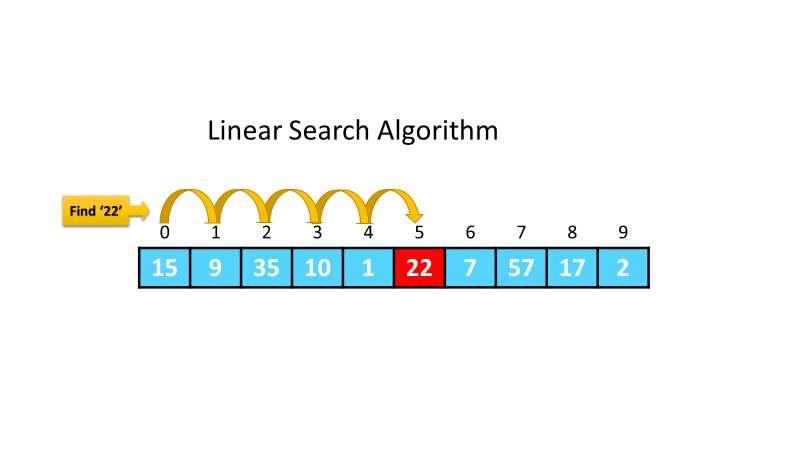
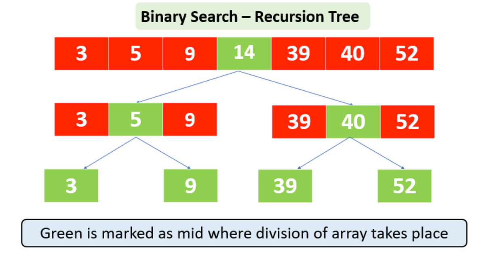

Algorithms : 
 - Sort : 
   - Bubble
   - Insertion
 - Search : 
   - Linear
   - Binary

# Sort
## Bubble

 - Program loops/passes through list of items
 - "bubbles" items larger than items before it past it, does not move it up if smaller. If equal to doesn't matter
 - Passes the list n times to ensure all items have been bubbled up
 - Worse time case is O(n^2) - Loops through n items in list n times

## Insertion

 - Starting on 2nd item, loop through list
 - If item is less than item before it loop backwards
 - Keep looping backwards and swapping the item with the item before it until it is greater than it
 - Return back to original position before looping backwards and continue until reaching end of list
 - Worse time case is O(n^2) - Loops through n items in list which each could loop back n times

# Search
## Linear

 - Goes through each item in the list sequentially
 - Checks if the item is the one being searched for
 - Returns the position of the item if it finds it, otherwise returns -1 (may return amount of times it was found and those positions)
 - Worse time case is O(n) - Loops through n items in list

## Binary

 - Finds midpoint of list, item it is looking for is at the midpoint the position and ends
 - Otherwise checks if item it is finding is > or < the midpoint and recalculates the midpoint at that side and repeats
 - List must be sorted before hand
 - If both sides cross over then it is not in the list and ends
 - Worse time case is O(log n) - Halves the list each time it loops through